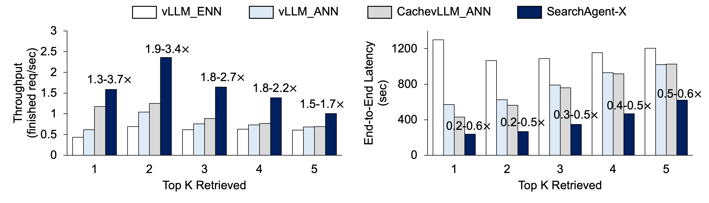

<div align="center">    
   <br>
</div>

***

<p align="center">
  <strong>SearchAgent-X</strong> is a highly efficient system for reasoning-search interleaved large language model (LLM) agents. <br>
  Compared to the popular LLM inference framework vLLM and HNSW-based retrieval methods, it achieves <strong>1.3–3.4×</strong> higher throughput with only <strong>0.2–0.6×</strong> the latency. See detailed techniques in <a href="https://arxiv.org/abs/2505.12065">our paper</a> .
</p >

<div align="center">    
  
</div>

---

## 🚀 Quick Start

### Environment
- Retriever (and Encoder)
  ```bash
  conda create -n retriever_env python=3.12.9
  pip install -r retriever_requirements.txt
  ```
- Generator
   ```bash
   conda create -n SearchAgent-X python=3.9
   pip install -r generator_requirements.txt
   ```

### Datasets & Models
SearchAgent-X requires these datasets and models for running interleaved search and reasoning. Here we introduce our experimental settings. You can definitely change them to your own datasets/models. Remember where you store them for later configuration.
- Corpus:  [wiki-18-corpus](https://huggingface.co/datasets/PeterJinGo/wiki-18-corpus)
- Embedding Model:  [all-MiniLM-L6-v2](https://huggingface.co/sentence-transformers/all-MiniLM-L6-v2)
- ANN Index:  [Our HNSW Index](https://huggingface.co/datasets/TiannuoYang/hnsw_index)
- LLM Reasoning Model:  [7B model](https://huggingface.co/PeterJinGo/SearchR1-nq_hotpotqa_train-qwen2.5-7b-em-ppo/commit/44ac5ffefbee4d7d32890066e6f3888ad7a273a1); [14B model](https://huggingface.co/PeterJinGo/SearchR1-nq_hotpotqa_train-qwen2.5-14b-em-ppo-v0.2)
- Request Dataset:  [Musique](https://huggingface.co/datasets/RUC-NLPIR/FlashRAG_datasets/tree/main/musique)

### Run SearchAgent-X
- Start Retriever Server  
   ```bash
   conda activate retriever_env
   python vllm/entrypoints/emb_ret_server.py
   ```
- Modify the paths to your downloaded datasets and models in `config.py`
- Run experiments
   ```bash
   conda activate SearchAgent-X
   python vllm/entrypoints/searchagent-x.py
   ```
   The experimental results will be stored by default in the directory `experiments/output/`.


## 👨‍💻 For Developers
### How To Encode And Index My Own Corpurs?

### How To Use Other Reasoning Models?

### How To Deploy SearchAgent-X in Offline/Online Scenarios?

## Acknowledgments
SearchAgent-X is built upon [vLLM](https://github.com/vllm-project/vllm) for its high-performance PagedAttention; and [HNSWLib](https://github.com/nmslib/hnswlib) for its favorable tradeoff between retrieval speed and accuracy. Thanks for their awesome work! In addition, our motivation of addressing search agent efficiency comes from these pioneering search agent models: [Search-R1](https://github.com/petergriffinjin/search-r1), [ReSearch](https://github.com/Agent-RL/ReCall?tab=readme-ov-file), and [R1-Search](https://github.com/RUCAIBox/R1-Searcher). We believe this agentic paradigm will be the next generation of RAG.